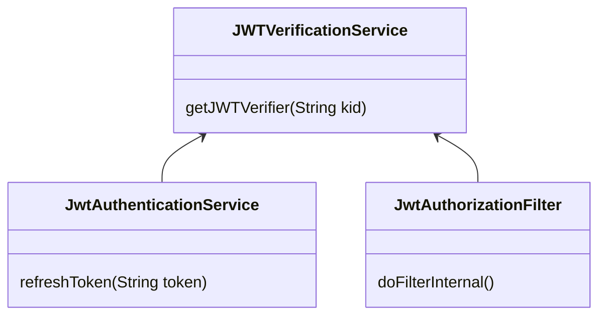

# Overview

1. RSA 키 생성
    - JWT 서명을 위해 RSA 키 쌍을 생성합니다.
    - 비밀 키와 공개 키를 생성합니다.
2. JWT 생성
    - 헤더와 페이로드가 JSON 객체로 결합되어 Base64로 인코딩
    - 헤더에는 일반적으로 JWT 서명에 사용된 알고리즘에 대한 정보가 포함, 페이로드에는 개체(예: 사용자 또는 시스템) 및 추가적인 메타데이터에 대한 클레임 포함
3. JWK 생성
    - JWK는 서명을 확인하는 데 사용되는 공개 키를 포함하는 JSON 객체
    - JWK는 안전하게 저장
    - .well-known/jwks.json 엔드 포인트를 가지는 서비스가 있어야함
4. JWT 확인
    - Base64로 인코딩 된 헤더와 페이로드를 디코딩
    - JWK에서 얻은 공개 키를 사용하여 서명을 확인, 서명이 유효하면 JWT를 신뢰할 수 있음
5. 클레임 확인
    - 클레임에는 발급자, 주제, 만료 시간 및 수신자 등의 정보가 포함

## Advantages
- 오직 개인키를 갖은 곳에서만 토큰에 서명을 생성 할 수 있고, 모든 곳에서 공개키를 가지고 유효성 검사를 함
- 개인키가 손상된 경우, 키 순회를 하면 됨

# Features
### Sequence diagram


# Implementation
## 개인키, 공개키 발급 (RSA 알고리즘 사용)
1. KeyPairGenerator → RSA key pair 생성 [KeyGenerator](https://docs.oracle.com/javase/6/docs/technotes/guides/security/crypto/CryptoSpec.html#KeyPairGenerator) : used to generate a new pair of public and private keys suitable for use with a specified algorithm. (새로운 키 생성)
2. Key Id 생성 (UID) → private, public key 쌍 연결
3. private key 저장 → private key base64 인코딩 후 저장 [KeyFactory](https://docs.oracle.com/javase/6/docs/technotes/guides/security/crypto/CryptoSpec.html#KeyFactory) : used to convert existing opaque cryptographic keys of type into key specifications (transparent representations of the underlying key material), and vice versa.
    1. jwt 를 만들 때, header 에 kid를 포함 시켜야함
    2. private key Base64 ecoding 문자열 변환하여 DB 저장
4. public key 저장 → kid, kty, modulus, public exponent를 base64 인코딩 후 저장

## 개인키, 공개키 데이터 물리리 모델링 (칼럼의 데이터 타입과 길이 선정)

무분별한 칼럼의 길이가 크게 선정되면 디스크의 공간, 메모리나 CPU 자원 낭비

- 문자열(CHAR, VARCHAR)
    - 1문자와 1바이트: 1문자는 1~4 바이트공간차지
- TEXT(문자), BLOB(이진데이터)
    - 문자열이나 이진 값의 길이가 예측할 수 없이 클때
    - 길이를 예측할 수 없는 base64로인코딩한 문자열을 저장하기 위해 사용 (private key, modulus, public exponent)

```sql
create table private_key
(
    kid         varchar(50) primary key,
    private_key text not null,
    create_date timestamp default CURRENT_TIMESTAMP not null
);
```

```sql
create table public_key
(
    kid         varchar(50) primary key,
    kty         varchar(50) not null,
    n           text not null,
    e           varchar(10) not null,
    create_date timestamp default CURRENT_TIMESTAMP not null
);
```

## JWK endpoint

1. auth 서버에 ~/.well-known/jwks.json 엔드 포인트 생성
2. endpoint 요청 → jwk set 전달
    1. findAll vs findByCreateDateAfter(validDate) : 유효한 날짜를 현재 날짜로 부터 삼주 전부터로 두었고 삼주 전보다 이전에 생성한 public key 를 응답값에서 제외 시켰다.

```json
{
    "keys": [
        {
            "kty": "RSA",
            "e": "AQAB",
            "kid": "HEyshtgyQ1G5cOtC9oMrdA",
            "n": "AKB398YaevtlG4Cxi71180vHnYuBLCTIN-pKnjVez7qWTcTswp-e8k8NhfXSWlGvpozWXhKhdiWrzyjVC1k3x5_vZuyxFkzMglHtmWEp1eezaWJPJ5nP2nSLaSX4r2bp4p6-94to4-h-XABiy8IqvMg2coKnBaPMv1aPTePZBOwX"
        },
        {
            "kty": "RSA",
            "e": "AQAB",
            "kid": "qW---oj4QBKBzVzBZPT09Q",
            "n": "AN4C6YpZoWhs6rJTS5dKSmuXPM39uYozIWn2xjHiYb3OeGdGaQUQ5imjJ3DI2XcOKknS_mL9duNIute2qgFOyL_Ac-6XFIxidNZKFzrEOoFBYDDIQVl3kKaPuh7Q0HeOt6silTpo3QUyZzXjCMbvYeWlGk8Dq_oOr62z0NnET2gx"
        },
        {
            "kty": "RSA",
            "e": "AQAB",
            "kid": "ukCSeGKBTIy1IE14UH2bzg",
            "n": "AKC1C9pmiRE_4xM4FJBgPRGWFVS_1OsfdKMXdejYtKWMEQEohqpwyhD1g-VB2ciRm43bK1GvEkWDM9vHTQJ89MUHlQIWK9oAVnqXsdEiGzUmMfFeuQqZw4IZhuIbuoJ9BoOR9gGGhFbTD_nJgI80-GG299SJMJnL4lgnyvfinPNX"
        }
    ]
}
```

## JWT 발급
**Private key 필요**
redis cache 를 사용해서 private key, kid 를 새로 업데이트하기 전까지 데이터베이스에서 가져오지 않도록 한다
1. SpringBoot 종속성 추가
    
    ```yaml
    implementation 'org.springframework.boot:spring-boot-starter-cache'
    ```
    
2. RedisCacheConfiguration  으로 CacheManager 객체 생성 (직렬화) 빈으로 등록
3. Config 파일에 @EnableCaching 애노테이션 추가
4. @Cacheable, @CacheEvict 를 빈으로 등록한 CacheManager와 함께 사용

## JWT 유효성 검사
**유효성 검사 로직**

임시적으로 대칭키(secret key)를 사용해서 유효성 검사를 하는 부분을 남겨 둔다 → JWTVerifierService 객체에서 kid 가 null 이면 대칭기 알고리즘을 사용하는 JWTVerifier을 넘겨준다




## Introspection Endpoint (JWT 검사)

AUTH 서버에 JWT 유효성 검사 (비대칭 알고리즘) enpoint 구현

Resource/Internal 서버에 access token 검증 방법을 제공한다. RFC 문서의 프로토콜을 따른다. 응답 값으로 “active” 변수에 true 또는 false 값을 전달 한다.

# Reference
JCA 암호화, 보안

https://d2.naver.com/helloworld/197937 

https://d2.naver.com/helloworld/227016 

Java Cryptography Architecture (JCA)

JWKS

https://auth0.com/docs/secure/tokens/json-web-tokens/json-web-key-set-properties 

https://auth0.com/docs/secure/tokens/json-web-tokens/json-web-key-sets 

Signing Algorithm

https://auth0.com/docs/get-started/applications/signing-algorithms 

https://assets.ctfassets.net/2ntc334xpx65/o5J4X472PQUI4ai6cAcqg/13a2611de03b2c8edbd09c3ca14ae86b/jwt-handbook-v0_14_1.pdf

Introspection Endpoint

https://www.oauth.com/oauth2-servers/token-introspection-endpoint/ 

https://datatracker.ietf.org/doc/html/rfc7662

cache in spring
[https://docs.spring.io/spring-boot/docs/2.1.6.RELEASE/reference/html/boot-features-caching.html](https://docs.spring.io/spring-boot/docs/2.1.6.RELEASE/reference/html/boot-features-caching.html)

[https://docs.spring.io/spring-framework/docs/3.2.6.RELEASE/spring-framework-reference/htmlsingle/#cache](https://docs.spring.io/spring-framework/docs/3.2.6.RELEASE/spring-framework-reference/htmlsingle/#cache)