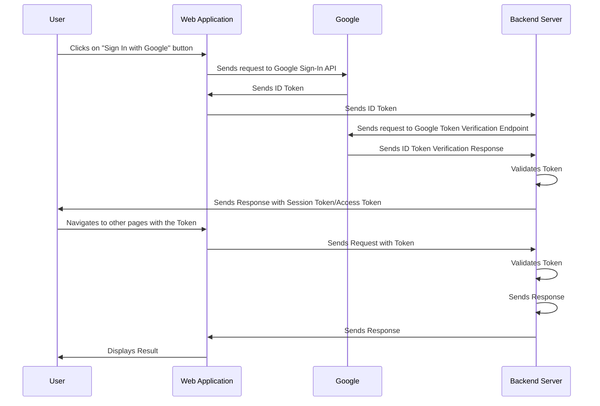

# Overview

1. 사용자는 Google 계정을 사용하여 웹 애플리케이션에 로그인하고, Google Provider는 ID 토큰 (**id_token,** JWT)을 클라이언트 측에 반환
2. 클라이언트 측은 ID 토큰(**id_token,** JWT)을 백엔드 서버에 전송
3. 백엔드 서버는 Google의 공개 키를 JWK(JSON Web Key) 엔드포인트에서 가져와 유효성을 검증
4. ID 토큰이 유효한 경우, 백엔드 서버는 토큰에서 이메일같은 사용자 정보를 추출
5. 백엔드 서버는 데이터베이스에서 사용자 정보가 있는지 확인하여 사용자가 이미 등록된 사용자인지 확인한다. 사용자가 이미 등록된 경우 로그인 진행, 아닌 경우 회원가입 후 로그인 진행 및 AE JWT을 생성
6. 백엔드 서버는 액세스 토큰을 클라이언트 측으로 다시 전송하여 저장하고, 서버에 권한 부여 요청을 할 때 사용

# Requirement/ Design aspect

- **Google Cloud project ([https://developers.google.com/identity/gsi/web/guides/basic-use](https://developers.google.com/identity/gsi/web/guides/basic-use))**
- Google Cloud Console project
- Frontend -  웹애플리케이션, Google Sign-In API 활성화, Client ID
- Backend - Google API 통신(ID 토큰 검증), AE 로그인, AE token generation

### Privacy

- 개인정보 동의

### Security

- password (저장 안함)
- 사용자 정보 사용 주의

### Backend Server

- JWK, google API 로 google ID token 유효성 검증
- Google 에서 발행한 토큰이 맞는지 확인
- 인증 후 새로운 유저 생성

### Error handling

- 의미있는 에러, 예외 반환

# Features

### Sequence Diagram



# Implementation
### 1. API 수정
sso login filter 에 새로운 provider google 추가 

### 2. Google ID Token(JWT) 를 검증하는 방법 선택, 구현

- JWK 를 사용
    - 예시
        
        ```java
        JwkProvider provider = new JwkProviderBuilder("https://www.googleapis.com/oauth2/v3/certs").build();
        // Get the ID token as a String
        // Decode the ID token to obtain the kid (key ID) and use it to obtain the JWK
        DecodedJWT jwt = JWT.decode(tokenString);
        String kid = jwt.getKeyId();
        com.auth0.jwk.Jwk jwk = provider.get(kid);
        
        // Verify the ID token signature using the JWK
        Algorithm algorithm = Algorithm.RSA256((RSAPublicKey) jwk.getPublicKey(), null);
        JWTVerifier verifier = JWT.require(algorithm)
            .withIssuer("https://accounts.google.com")
            .withAudience(CLIENT_ID)
            .build();
        DecodedJWT decodedToken = verifier.verify(tokenString);
        
        // Extract the user information from the decoded token
        String userId = decodedToken.getSubject();
        String name = decodedToken.getClaim("name").asString();
        String email = decodedToken.getClaim("email").asString();
        // ...
        ```
        
- Google API Client Library
    - `CLIENT_ID` : Google API client ID 가 필요함
    - 예시
        
        ```java
        import com.google.api.client.googleapis.auth.oauth2.GoogleIdToken;
        import com.google.api.client.googleapis.auth.oauth2.GoogleIdToken.Payload;
        import com.google.api.client.googleapis.auth.oauth2.GoogleIdTokenVerifier;
        
        ...
        
        GoogleIdTokenVerifier verifier = new GoogleIdTokenVerifier.Builder(transport, jsonFactory)
            // Specify the CLIENT_ID of the app that accesses the backend:
            .setAudience(Collections.singletonList(CLIENT_ID))
            // Or, if multiple clients access the backend:
            //.setAudience(Arrays.asList(CLIENT_ID_1, CLIENT_ID_2, CLIENT_ID_3))
            .build();
        
        // (Receive idTokenString by HTTPS POST)
        
        GoogleIdToken idToken = verifier.verify(idTokenString);
        if (idToken != null) {
          Payload payload = idToken.getPayload();
        
          // Print user identifier
          String userId = payload.getSubject();
          System.out.println("User ID: " + userId);
        
          // Get profile information from payload
          String email = payload.getEmail();
          boolean emailVerified = Boolean.valueOf(payload.getEmailVerified());
          String name = (String) payload.get("name");
          String pictureUrl = (String) payload.get("picture");
          String locale = (String) payload.get("locale");
          String familyName = (String) payload.get("family_name");
          String givenName = (String) payload.get("given_name");
        
          // Use or store profile information
          // ...
        
        } else {
          System.out.println("Invalid ID token.");
        }
        ```
        

# Module Interaction

# Reference

- Client Library
    - Google Sign-In JavaScript platform library for Web is deprecated.
    - Google Identity Services for Web provides more **flexibility, customization option and additional features**
        - set up with Google Identity Services for Web
            1. **Create a Google Cloud project**: If you haven't already, create a Google Cloud project in the Google Cloud Console. This project will be used to create and manage the credentials and configuration required for Google login.
            2. **Configure the Google Identity Services for Web**: In the Google Cloud Console, navigate to the Google Identity Services for Web settings page for your project. Here you can configure various settings, such as the OAuth consent screen, authorized domains, and OAuth client credentials.
            3. **Add the Google Sign-In SDK**: Add the Google Sign-In SDK to your client-side web application by including the following script tag in your HTML:
                
                ```jsx
                htmlCopy code
                <script src="https://accounts.google.com/gsi/client"></script>
                
                ```
                
            4. **Render the sign-in button**: Render the Google Sign-In button in your web page by adding the following HTML:
                
                ```jsx
                htmlCopy code
                <div id="g_id_signin"></div>
                
                ```
                
            5. **Initialize the SDK**: Initialize the Google Sign-In SDK by calling the **`gsi.client.init()`** function with your client ID and any other desired configuration options. For example:
                
                ```jsx
                javascriptCopy code
                gsi.client.init({
                  client_id: 'YOUR_CLIENT_ID',
                  ux_mode: 'popup'
                });
                
                ```
                
            6. **Handle sign-in events**: Implement the necessary event listeners to handle sign-in and sign-out events. For example:
                
                ```jsx
                javascriptCopy code
                gsi.client.on('credential', function(response) {
                  // Handle successful sign-in
                });
                
                gsi.client.on('error', function(error) {
                  // Handle sign-in error
                });
                
                gsi.client.on('user_closed', function() {
                  // Handle sign-in cancelation
                });
                
                gsi.client.on('user_logged_out', function() {
                  // Handle sign-out
                });
                
                ```
                
            
            These are the basic steps required to set up Google login with the new Google Identity Services for Web. For more detailed instructions and options, please refer to the official documentation at **[https://developers.google.com/identity/gsi/web/guides/basic-use](https://developers.google.com/identity/gsi/web/guides/basic-use)**.
            
- OAuth 2.0 and OpenID Connect (OIDC) for Single Sign-On (SSO):
    - [https://developers.google.com/identity/protocols/oauth2](https://developers.google.com/identity/protocols/oauth2)
- **서버 측에서 Google ID 토큰 확인**
    - [https://developers.google.com/identity/gsi/web/guides/verify-google-id-token?hl=ko](https://developers.google.com/identity/gsi/web/guides/verify-google-id-token?hl=ko)
- 사용자 승인 작동 방식 (흐름)
    - [https://developers.google.com/identity/oauth2/web/guides/how-user-authz-works?hl=ko](https://developers.google.com/identity/oauth2/web/guides/how-user-authz-works?hl=ko)